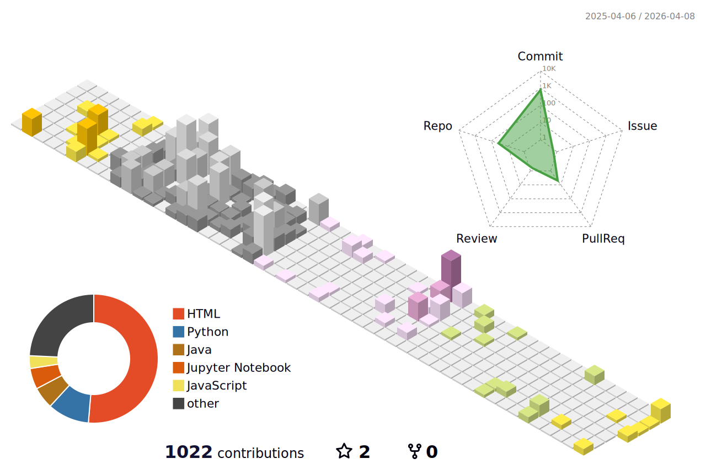

<h1 align="center">Hi, I'm JIA-YI,ZHU</h1>
<h3 align="center">Software Dev.</h3>

  

- 

- 📄 Know about my experiences [https://zhuj05.github.io/hello/form.html](https://zhu7055.github.io/hello/form.html)

- I'm currently pursuing a second bachelor's degree in Department of Management Information.(The required textbooks for this course are copyrighted. Please purchase genuine copies.)
- 🌱 I’m currently learning
  
        
        

<h3 align="left">Connect with me:</h3>

  
  

<h3 align="center">Languages and Tools:</h3>
<!--Frontend欄位-->
<table><tr><td valign="top" width="50%">
<h3>Frontend</h3>

     
    </a> 
   

  </td>
  <td valign="top" width="50%">
<!--Backend欄位-->
<h3>Backend</h3>

    

 

  
  </td></tr>

  <tr>
<!--General Tools 欄位-->
<td valign="top" width="50%">
<h3>General Tools</h3>

     
     
      
    
    
  

  

    
</td><td valign="top" width="50%">
  <!--Domain Specific Application欄位-->
<h3>Domain Specific Application</h3>
 
   
    
      
   
  
    
  <a href="https://developer.android.com/studio?hl=zh-tw" target="_blank" rel="noreferrer">
    
      <a href="https://kotlinlang.org" target="_blank" rel="noreferrer"> 
    
    

  </td></tr>
  <tr>
  <!--欄位Data Anaysis-->
  <td valign="top" width="50%">
<h3>Data Analysis</h3>

   
    

</a>

  </td>
  <td valign="top" width="50%">
<!--Testing Tools欄位-->
<h3>Testing Tools</h3>
 

  </td>
  </tr>
  </td>
  
  </table>

<h3 align="center">Trophy Case:</h3>

  </td><td valign="top" width="33%">
<h3 align="center">Most Used Languages:</h3>

<h3 align="center">Project:</h3>
<table>
  <tr>
    <th>Topic</th>
    <th>Summary</th>
  </tr>
  <tr>
    <td><a href="https://github.com/zhu7055/FHIR-EMR">FHIR EMR</a></td>
    <td>Capstone Project(In University),convert data to json format,upload to FHIR Server. Use Javascript to Download data from FHIR Server. 1.開立委外檢查單 C# Upload委外項目,Client 端在FHIR Server use javascript download資料
     2.檢驗委外 Python Upload報告結果,Client 端在FHIR Server use javascript download檢驗結果
    </td>
  </tr>
  <tr>
    <td><a href="https://github.com/zhu7055/kaggle_advanced_sql">Advanced_SQL</a></td>
    <td>JOIN UNION,SQL,Efficient Query</td>
  </tr>
  <tr>
    <td><a href="https://github.com/zhu7055/pytorch-tutorial">pytortch_tutorial</a></td>
    <td>Deep Learning Framework(深度學習框架) Deep learning model training</td>
  </tr>
  <tr>
    <td><a href="https://github.com/zhu7055/kaggle_Feature_Engineering">Feature_Engineering</a></td>
    <td>The process of converting data into meaningful features in machine learning</td>
  </tr>
  <tr>
    <td><a href="https://github.com/zhu7055/react_app">react_app</a></td>
    <td>Basic React.js application</td>
  </tr>
  <tr>
    <td><a href="https://github.com/zhu7055/kaggle_visualization">Data visualization</a></td>
    <td>Data Visualization examples, including various chart types and data analysis applications</td>
  </tr>
  <tr>
    <td><a href="https://github.com/zhu7055/Python_Algorithms">Python_Algorithms</a></td>
    <td>Collection of various algorithms implemented entirely in Python.</td>
  </tr>
  <tr>
    <td><a href="https://github.com/zhu7055/JAVA_Algorithms">JAVA_Algorithms</a></td>
    <td>Collection of various algorithms implemented entirely in Java.</td>
  </tr>
  <tr>
    <td><a href="https://github.com/zhu7055/Leetcode_practice">Leetcode_practice</a></td>
    <td>Leetcode_practice</td>
  </tr>
  <tr>
    <td><a href="https://github.com/zhu7055/kaggle_computer_vision">Computer Vision</a></td>
    <td>consists of Jupyter Notebooks that explore various computer vision concepts, including convolutional neural networks, data augmentation, and other related techniques.</td>
  </tr>
  <tr>
    <td><a href="https://github.com/zhu7055/javascript_project">javascript_project</a></td>
    <td>collection of JavaScript applications like a Calculator, Clock, and ToDoList, featuring various optimizations and comments.</td>
  </tr>
  
  <tr>
    <td><a href="https://github.com/zhu7055/Personal_Project">Personal_Project</a></td>
    <td>Some Project made in school.</td>
  </tr>
  
  <tr>
    <td><a href="https://github.com/zhu7055/Geospatial_Analysis">Geospatial_Analysis</a></td>
    <td>Python:numpy,pandas,Geopandas(空間資料處理),CRS(Coordinate Reference System,座標參考系統),
Interactive Map,Manipulating Geospatial Data</td>
  </tr>
  <tr>
    <td><a href="https://github.com/zhu7055/seleniumbase">seleniumbase</a></td>
    <td>Simplify web automation testing and data scraping tasks</td>
  </tr>
<tr>
    <td><a href="https://github.com/zhu7055/psql">PSQL</a></td>
    <td>Some PostgreSQL Command.</td>
  </tr>
  <tr>
    <td><a href="https://github.com/zhu7055/simple-crud-app-backend">crud-app-backend</a></td>
    <td>This project is a backend development project that builds a complete RESTful CRUD API from scratch using Node.js, Express, and MongoDB.</td>
  </tr>
  <tr>
    <td><a href="https://github.com/zhu7055/Customer-consumption-statistics-analysis_Power-BI">Customer-consumption-statistics-analysis_Power-BI</a></td>
    <td>This repository contains a Power BI project for analyzing customer consumption statistics, including a PDF report and images.</td>
  </tr>
<tr>
    <td><a href="https://github.com/zhu7055/PM2.5-in-each-city_Power-BI">PM2.5-in-each-city_Power-BI</a></td>
    <td>This repository contains a Power BI project for visualizing PM2.5 data in various cities.</td>
  </tr>
  <tr>
    <td><a href="https://github.com/zhu7055/flask_mongodb_api_crud/tree/main">flask_mongodb_api_crud</a></td>
    <td> The repository is a Flask-based API that uses MongoDB for database operations, demonstrating how to perform basic Create, Read, Update, and Delete (CRUD) functions.</td>
  </tr>
</table>

<!-- Contribuciones 3D GitHub -->

<h3 align=left>Support</h3>

